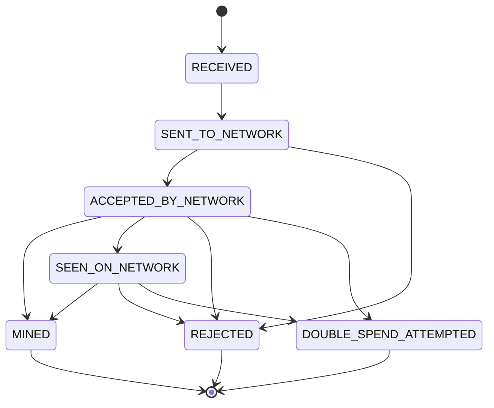
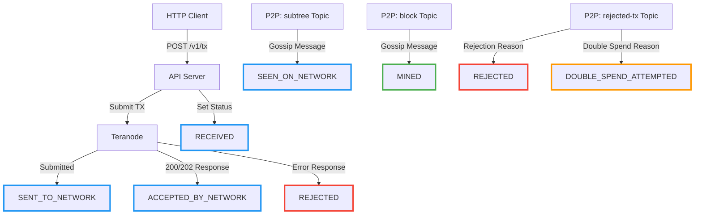
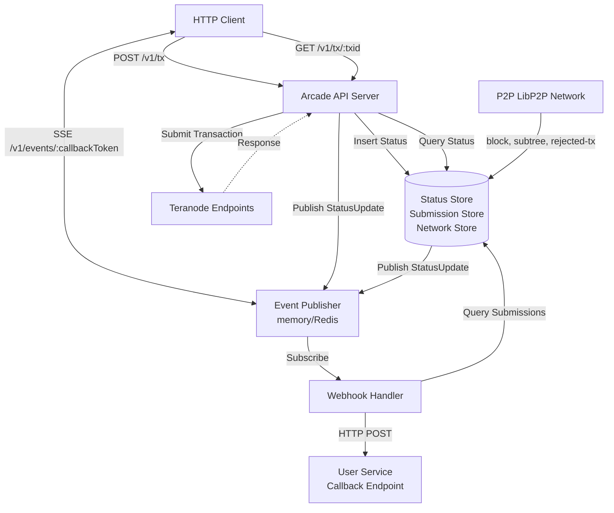
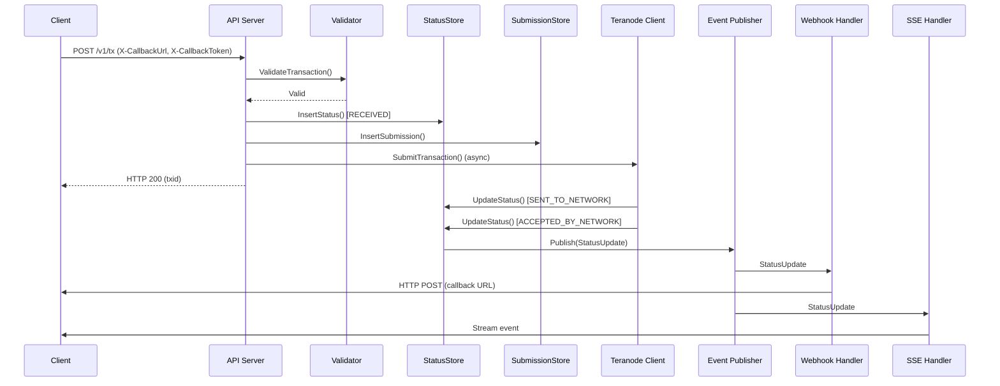
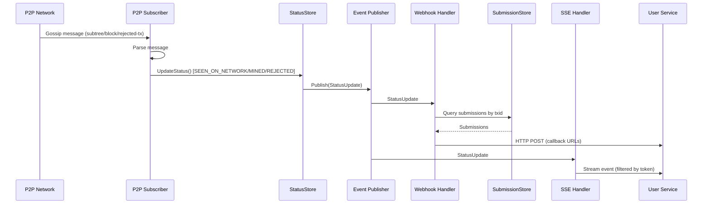
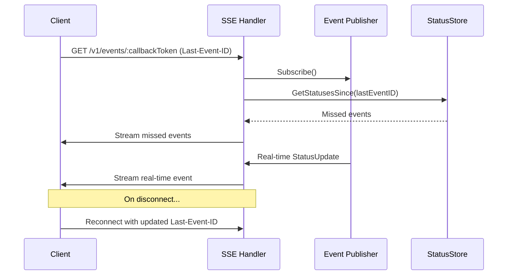

# Arcade Architecture

## Overview

Arcade is a P2P-first Bitcoin transaction broadcast client for Teranode that provides an Arc-compatible HTTP API. It implements a pluggable architecture with support for multiple storage backends (SQLite, PostgreSQL) and event systems (in-memory, Redis).

## Transaction State Model

### Status States

Transactions progress through a defined set of states, managed as an append-only log.

### State Transitions and Triggers



**Components and State Triggers:**



### Status Definitions

| Status | Set By | Trigger |
|--------|--------|---------|
| `RECEIVED` | API Server | Transaction accepted via POST /v1/tx |
| `SENT_TO_NETWORK` | Teranode Client | Teranode returns 202 (queued) |
| `ACCEPTED_BY_NETWORK` | Teranode Client | Teranode returns 200 (accepted) |
| `SEEN_ON_NETWORK` | P2P Subscriber | Subtree gossip message received |
| `MINED` | P2P Subscriber | Block gossip message contains transaction |
| `MINED_IN_STALE_BLOCK` | P2P Subscriber | ChainTracks detects block reorganization |
| `REJECTED` | Teranode Client / P2P Subscriber | Teranode error or P2P rejected-tx message |
| `DOUBLE_SPEND_ATTEMPTED` | P2P Subscriber | P2P rejected-tx with double spend reason |

**Arc Statuses Not Implemented in Arcade:**

| Arc Status | Reason Not Implemented |
|------------|------------------------|
| `UNKNOWN` | Arcade uses explicit initial state (`RECEIVED`) |
| `QUEUED` | Arcade has no queue timeout - returns immediately |
| `STORED` | Not needed - storage is implicit |
| `ANNOUNCED_TO_NETWORK` | P2P network details not tracked at this granularity |
| `REQUESTED_BY_NETWORK` | P2P network details not tracked at this granularity |
| `SEEN_IN_ORPHAN_MEMPOOL` | Does not map to Arcade's architecture |

## System Communication Overview



### Communication Interfaces

#### 1. HTTP API (Arc-Compatible)

**Transaction Submission:**
- `POST /v1/tx` - Submit single transaction (raw hex)
- `POST /v1/txs` - Submit batch transactions (array of hex)

**Request Headers:**
- `X-CallbackUrl` - Webhook endpoint for status notifications
- `X-CallbackToken` - Token for webhook authentication and SSE filtering
- `X-FullStatusUpdates` - Boolean to receive all intermediate statuses
- `X-WaitFor` - Target status before HTTP response (not fully implemented)
- `X-MaxTimeout` - Maximum wait time (5-30 seconds)
- `X-SkipFeeValidation` / `X-SkipScriptValidation` - Validation overrides

**Status Query:**
- `GET /v1/tx/:txid` - Returns current status and timestamp

**Response Format:**
```json
{
  "txid": "abc123...",
  "txStatus": "DOUBLE_SPEND_ATTEMPTED",
  "timestamp": "2024-01-15T10:30:00Z",
  "competingTxs": ["def456..."]
}
```

#### 2. Server-Sent Events (SSE)

**Endpoint:** `GET /v1/events/:callbackToken`

**Features:**
- Callback token-based filtering (only events matching the callback token)
- Automatic catchup using `Last-Event-ID` header
- Event IDs are nanosecond timestamps for ordering
- Supports browser auto-reconnection

**Event Format:**
```
id: 1699632123456789000
event: status
data: {"txid":"abc...","status":"SEEN_ON_NETWORK","timestamp":"2024-01-15T10:30:00Z"}
```

#### 3. Webhook Notifications

**Delivery:**
- Asynchronous HTTP POST to callback URL
- Bearer token authentication using callback token
- Exponential backoff retry on failure
- Configurable max retries and expiration

**Request Format:**
```json
POST {callbackUrl}
Authorization: Bearer {callbackToken}

{
  "txid": "abc123...",
  "txStatus": "MINED",
  "timestamp": "2024-01-15T10:35:00Z"
}
```

**Delivery Tracking:**
- Prevents duplicate notifications for same status
- Tracks retry count and next retry time
- Respects `X-FullStatusUpdates` preference

#### 4. P2P LibP2P Gossip

**Subscribed Topics:**
- `{prefix}-block` - Block announcements with height and hash
- `{prefix}-subtree` - Validated unmined transactions
- `{prefix}-rejected-tx` - Transaction rejection notifications

**Message Processing:**
- Block messages contain transaction IDs, mark transactions as `MINED`
- Subtree messages contain transaction IDs, mark transactions as `SEEN_ON_NETWORK`
- Rejected-tx messages parse rejection reason and mark as `REJECTED` or `DOUBLE_SPEND_ATTEMPTED` based on the rejection type

**ChainTracks Integration:**
- Maintains blockchain state (current height, block hashes)
- Used to detect chain reorganizations for `MINED_IN_STALE_BLOCK` status

#### 5. Teranode HTTP Client

**Submission:**
- `POST {endpoint}/tx` with raw transaction bytes
- Fan-out to multiple Teranode endpoints concurrently
- 30-second timeout per request

**Response Handling:**
- `200` - Transaction accepted → `ACCEPTED_BY_NETWORK`
- `202` - Transaction queued → `SENT_TO_NETWORK`
- `4xx/5xx` - Error → `REJECTED` with error details

## Event System

### Architecture

The event system uses a publisher/subscriber pattern with pluggable backends:

**Interface:**
```go
type Publisher interface {
    Publish(ctx context.Context, update StatusUpdate) error
    Subscribe(ctx context.Context) (<-chan StatusUpdate, error)
    Close() error
}
```

**Event Type:**
```go
type StatusUpdate struct {
    TxID      string
    Status    Status
    Timestamp time.Time
}
```

### Event Flow

1. **Status Change** → `StatusStore.UpdateStatus()` called
2. **Publish** → `Publisher.Publish()` broadcasts event
3. **Fan-Out** → Multiple subscribers receive event:
   - Webhook Handler queries submissions and delivers notifications
   - SSE Handler filters by token and streams to connected clients
   - Future: WaitFor handler blocks HTTP responses until target status
   
### Backends

**In-Memory Publisher:**
- Go channels with configurable buffer size
- Fan-out to multiple goroutine subscribers
- Non-blocking publish (drops slow consumers)
- Single-node deployments only

**Redis Publisher:**
- Redis Pub/Sub on channel `arcade:status_updates`
- JSON-serialized events
- Supports multi-node distributed deployments
- Events survive service restarts if subscribers reconnect

## Storage Layer

### Store Interfaces

**StatusStore:**
- `InsertStatus()` - Initial submission (status: RECEIVED)
- `UpdateStatus()` - P2P or Teranode updates
- `GetStatus()` - Current status for transaction
- `GetStatusHistory()` - All status changes over time
- `GetStatusesSince()` - Catchup query for SSE

**SubmissionStore:**
- `InsertSubmission()` - Register client subscription
- `GetSubmissionsByTxID()` - Query for webhook delivery
- `GetSubmissionsByToken()` - Query for SSE filtering
- `UpdateDeliveryStatus()` - Track webhook delivery and retries

**NetworkStateStore:**
- `UpdateNetworkState()` - Current block height/hash from P2P
- `GetNetworkState()` - Query current blockchain state

### Implementations

**SQLite:**
- Single database file
- Append-only transaction status log
- Indexes: `txid`, `timestamp`, `callback_token`
- JSON storage for competing transaction arrays

**PostgreSQL:**
- Same schema as SQLite
- Better for multi-node deployments with Redis events
- Connection pooling for concurrent access

## Component Initialization

Application startup sequence ([cmd/arcade/main.go](cmd/arcade/main.go)):

1. Load configuration (YAML + environment variables)
2. Run database migrations
3. Create store instances (status, submission, network)
4. Initialize event publisher (memory or Redis)
5. Create Teranode client with endpoint list
6. Initialize transaction validator
7. Start P2P subscriber (gossip listener)
8. Start webhook handler (event subscriber)
9. Start HTTP API server
10. Wait for shutdown signal (graceful cleanup)

## Data Flow Examples

### Transaction Submission



### P2P Status Update



### SSE Streaming with Catchup



## Configuration

Configuration is managed via Viper with YAML files and environment variable overrides (`ARCADE_*`).

**Key Sections:**
- `server` - HTTP address, timeouts, CORS
- `database` - Type (sqlite/postgres), connection string, migrations
- `events` - Type (memory/redis), Redis connection
- `teranode` - Endpoint list, timeout
- `p2p` - Peer list, topic prefix
- `validator` - Size limits, fee validation, script validation
- `webhook` - Retry policy, max retries, expiration
- `auth` - Token-based authentication (future)

## Architecture Patterns

**Pluggable Backends:**
Storage and event systems use interfaces to allow runtime configuration of backends without code changes.

**Event-Driven:**
All status changes flow through a central event system, enabling multiple notification channels (webhooks, SSE, future: long-polling).

**Async Processing:**
Transaction submission returns immediately. Teranode submission and webhook delivery happen asynchronously.

**Append-Only State:**
Status history is immutable. Current status is derived by querying the most recent entry.

**Token-Based Routing:**
Callback tokens isolate event streams for multi-tenant use cases. SSE and webhooks filter by token.

**Arc Compatibility:**
API endpoints, headers, and response formats match Arc specification for drop-in replacement scenarios.
