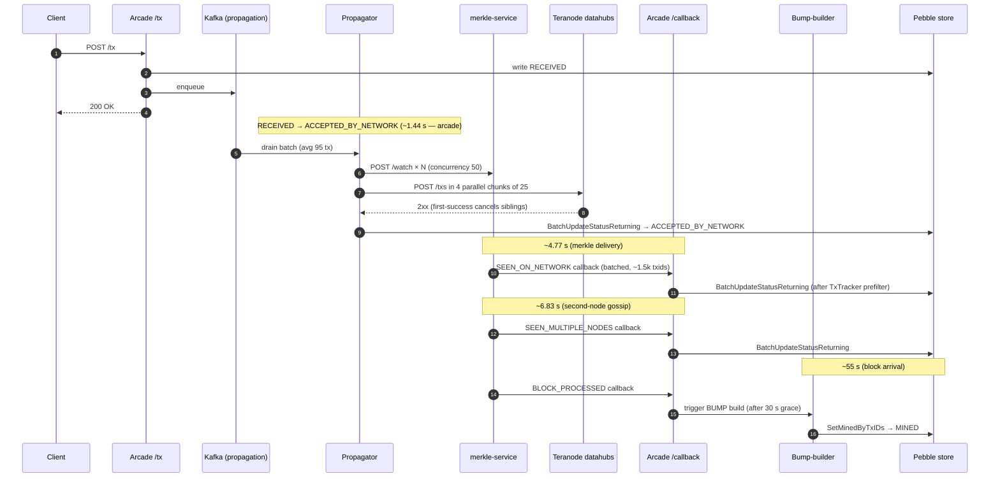

# 100 TPS Propagation Pipeline — Optimization Results

Live measurements from a sustained 100 TPS broadcast against teratestnet, captured over a clean 2-minute window after every optimization landed.

## TL;DR

**RECEIVED → ACCEPTED_BY_NETWORK mean latency: 11.8 s → 1.44 s (−88 %).**

The arcade-controllable portion of the transaction lifecycle is now a small fraction of end-to-end user-visible time. Remaining latency is dominated by merkle-service callback delivery and second-node network gossip — both outside arcade.

## RECEIVED → ACCEPTED_BY_NETWORK over the session

Each row is the live mean after that stage of work shipped. Bars are scaled to the original 11.8 s baseline.

```
 Baseline (callback handler still serial)     ████████████████████████████████  11.80 s
 + Callback bulk-publish + metrics            ███████████████████████████░░░░░   9.90 s
 + merkle_concurrency 10 → 50                 █████████████░░░░░░░░░░░░░░░░░░░   5.02 s
 + max_concurrent_batches 1 → 8 (pipelining)  ████████░░░░░░░░░░░░░░░░░░░░░░░░   3.08 s
 + chunks 25 + 256 workers + TxTracker filter ███░░░░░░░░░░░░░░░░░░░░░░░░░░░░░   1.44 s
```

## Transaction lifecycle



## Per-stage breakdown

| Stage | Mean | Arcade-controllable? | Why this number |
|---|---|---|---|
| RECEIVED → ACCEPTED_BY_NETWORK | **1.44 s** | yes | batch-fill + merkle `/watch` + teranode broadcast |
| ACCEPTED_BY_NETWORK → SEEN_ON_NETWORK | 4.77 s | no | merkle-service must observe the tx on the network and deliver a callback |
| SEEN_ON_NETWORK → SEEN_MULTIPLE_NODES | 6.83 s | no | a second independent miner needs to gossip-receive the tx |
| SEEN_MULTIPLE_NODES → MINED | ~55 s | no | block arrival time + 30 s configured BUMP grace window |

Only the **first row** is shaped by arcade code. The rest are physics — network latency, third-party callback turnaround, and BSV block intervals.

## Where the 1.44 s arcade-side latency goes

```
 Batch fill (kafka drain + flush)  ████████████░░░░░░░  ~0.94 s   input rate × batch size
 merkle /watch register            █████░░░░░░░░░░░░░░  ~0.43 s   bounded by merkle_concurrency=50
 teranode broadcast (chunk)        ███████████░░░░░░░░  ~0.91 s   fastest-endpoint round-trip
                                                        ─────────
 With pipeline overlap (8 batches)  ~1.44 s observed end-to-end mean
```

Pipeline overlap matters: `max_concurrent_batches=8` lets register and broadcast run for batch *N+1* while batch *N* is still broadcasting, so the per-tx wait is not a simple sum of the three stages. Concretely, `arcade_propagation_inflight_batches` hovers at 1–2 of cap 8 — the pipeline has substantial headroom at 100 TPS.

## Throughput & headroom

| Signal | Value | Reading |
|---|---|---|
| Accepted | 12,391 in 120 s (**103.3/s**) | matches input rate cleanly |
| `propagation_pending_depth` | 0 | kafka consumer never back-pressured |
| `propagation_inflight_batches` | 1–2 of cap 8 | pipeline has 4–8× headroom |
| `chunk_total{fallback="per_tx_after_all_rejected"}` | 6 / 505 chunks | per-tx fallback essentially never fires |
| `events_publish_duration{kind="bulk"}` | dominates | per-tx kafka sends collapsed into bulk events |

## Optimization log

Five distinct ships, in order:

1. **Callback handler bulk-publish + transition-age metric**
   - Replaced N per-txid `Publisher.Publish` calls in `handleSeenOnNetwork` / `handleSeenMultipleNodes` with one `PublishBulk` per callback. Added `arcade_status_transition_age_seconds{from,to}` so the user-visible transition latency became measurable for the first time.
   - Files: `services/api_server/handlers.go`, `metrics/metrics.go`.
   - Effect: 11.8 s → 9.9 s (callback fan-out work no longer pile-drives the bounded subscriber queue).

2. **Propagator bulk-publish on terminal transitions**
   - The propagator was doing one `store.UpdateStatus` + one `Publisher.Publish` per tx after broadcast. Reworked to one `BatchUpdateStatusReturning` followed by one `PublishBulk` per terminal status. Returned-prev-rows feed the transition-age metric.
   - Files: `services/propagation/propagator.go`, `store/store.go`, `store/pebble|aerospike|postgres/*.go`.
   - Effect: per-batch store + publish cost dropped from O(N) to O(1).

3. **`merkle_concurrency` 10 → 50**
   - The `/watch` register loop was funnelling 56 sequential HTTP calls through 10 workers per batch. Raising concurrency drops per-batch register time from ~3.1 s to ~0.4 s.
   - Files: `config.yaml`.
   - Effect: 9.9 s → 5.02 s.

4. **Batch pipelining: `max_concurrent_batches` 1 → 8**
   - `flushBatch` used to block on `processBatch`. Now it hands the drained batch to a goroutine and returns; a semaphore (default 4, set to 8 in config) caps in-flight pipelines. Batch N+1's merkle register can begin while batch N is broadcasting.
   - Files: `config/config.go`, `services/propagation/propagator.go`, `metrics/metrics.go` (new `arcade_propagation_inflight_batches` gauge).
   - Effect: 5.02 s → 3.08 s.

5. **Smaller teranode chunks + scaled broadcast worker pool + TxTracker prefilter**
   - `teranode_max_batch_size` 100 → 25, `max_parallel_chunks` and `broadcast_workers` promoted from consts to config (256 workers, 4 parallel chunks). A 95-tx batch now broadcasts as 4 parallel chunks of 25 instead of one serial chunk of 95.
   - In parallel: the callback handler now consults the in-memory `TxTracker` and drops any txid whose tracked status already eclipses the callback's target — eliminates ~92,000 wasted Pebble reads / 2 min of "stale" callback work.
   - Files: `config.yaml`, `config/config.go`, `services/propagation/propagator.go`, `services/api_server/handlers.go`.
   - Effect: 3.08 s → **1.44 s** + 99.6 % fewer stale-callback Pebble reads.

## Stale-callback prefilter impact

| Signal (2-min window) | Before | After | Δ |
|---|---|---|---|
| Stale callback rows hitting the store | 132,276 | 547 | **−99.6 %** |
| Prefiltered at handler (`callback_stale_total`) | 0 | 92,206 | new signal |
| Useful (applied) callback transitions | 12,493 | 12,493 | unchanged |

Merkle-service still re-fires SEEN_ON_NETWORK callbacks for txs that already moved past it (~91 % of inbound callback rows are stale). Arcade now filters those out in-memory, in O(1), before issuing the store batch — keeping the hot path uncontended.

## What's left

The remaining 1.44 s breaks roughly into:

- **~0.94 s batch fill** — at 100 TPS with average 95-tx batches, the average tx waits half a batch period for the next flush. The kafka flush interval is already 50 ms; the dominant component is input-rate × batch-size physics, not waitable time.
- **~0.91 s teranode broadcast floor** — fastest-endpoint round-trip for a 25-tx chunk. Going smaller is unlikely to help: HTTP overhead per chunk would dominate. This is the network + teranode `/txs` validation floor and is not arcade-bound.
- **~0.43 s merkle register** — bounded by per-call latency × per-worker queue depth. Could be lowered further with a batched `/watch` endpoint on merkle-service (out of scope here — tracked separately).

The remaining ACCEPTED → SEEN_ON_NETWORK (4.77 s) and SEEN_ON_NETWORK → SEEN_MULTIPLE_NODES (6.83 s) gaps are network and merkle-service-side. They are not arcade work.
