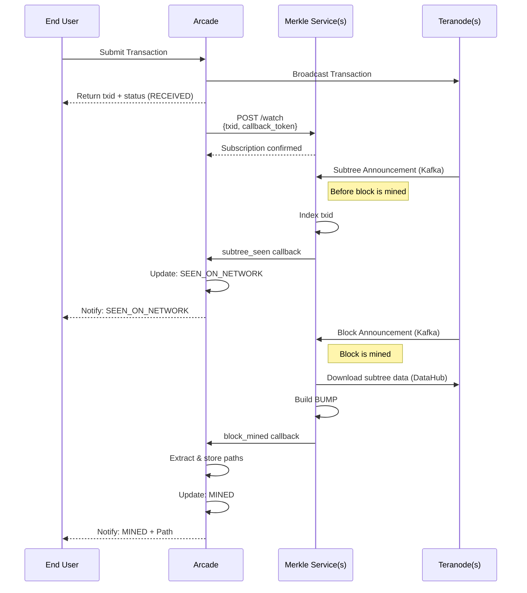

# Merkle Path Service - Project Proposal

## Executive Summary

We propose building a **Merkle Path Service** that provides on-demand Merkle path generation for any transaction on the BSV blockchain. This service will index transactions as they are prepared for mining (before blocks are created) and generate valid Merkle proofs on-the-fly when requested via API.

## Problem Statement

Currently, services that need to validate transaction inclusion in blocks face several challenges:

1. **Inaccessible Data**: P2P network announcements reference DataHub URLs that are often private and inaccessible
2. **No Progressive Indexing**: Services must wait for full blocks to be mined before indexing transactions
3. **Storage Inefficiency**: Storing pre-computed Merkle paths for all transactions is prohibitively expensive
4. **Reorg Complexity**: Handling chain reorganizations requires complex state management

## Proposed Solution

A dedicated service that:
- **Listens to Teranode** via Teranode Kafka/P2P for block and subtree announcements
- **Downloads and stores** subtree data locally from Teranode DataHub
- **Indexes progressively** as subtrees are announced (before blocks are mined)
- **Builds paths on-demand** using stored data and the BSV SDK's MerklePath functionality
- **Maintains canonical chain awareness** via ChainTracks integration

## Key Capabilities

### On-Demand Merkle Path Generation
```
GET /merkle/{txid}
→ Returns binary Merkle path for validation
```

The service constructs valid Merkle paths on-the-fly using:
- Block header data (subtree structure)
- Subtree transaction lists
- Coinbase transaction (for root calculation)

### Progressive Transaction Indexing

Traditional approach waits for full blocks (~10 minutes). Our approach:
- **Subtree announced** → Download and index transactions immediately
- **Block mined** → Link subtrees to canonical block
- **Result**: Transactions indexed within seconds of network announcement

### Canonical Chain Management

- Tracks the current blockchain tip via ChainTracks
- Handles chain reorganizations automatically
- Cleans up orphaned data after 100 blocks (immutable threshold)

## Architecture Overview

```
┌─────────────────────────────────────────────────────────┐
│              Teranode(s)                                │
│  ┌──────────────────┬────────────────────────────────┐  │
│  │ Kafka/P2P Topics │ DataHub                        │  │
│  │ • Subtree msgs   │ • Subtree transaction lists    │  │
│  │ • Block msgs     │ • Block header data            │  │
│  └──────────────────┴────────────────────────────────┘  │
└─────────────────────────────────────────────────────────┘
                           │
                           ▼
┌─────────────────────────────────────────────────────────┐
│               Merkle Service(s)                         │
├─────────────────────────────────────────────────────────┤
│  Ingestion: Consume Kafka/P2P, download from DataHub    │
│  Query: Build paths on demand                           │
│  Maintenance: Cleanup & reorg handling                  │
└─────────────────────────────────────────────────────────┘
                           │
                           ▼
┌─────────────────────────────────────────────────────────┐
│                   Storage Layer                         │
│  • Transaction index (primary cost)                     │
│  • Subtree data (transaction hashes)                    │
│  • Block headers (subtree structure)                    │
└─────────────────────────────────────────────────────────┘
```

## Transaction Flow

The following diagram shows how a transaction flows from broadcast through Merkle proof generation:



### Flow Explanation

1. **Transaction Broadcast**: User submits transaction to Arcade, which broadcasts to Teranode and returns a transaction ID

2. **Register with Merkle Service**: Arcade registers the transaction ID with Merkle Service using a callback token (which acts as the subscription ID)

3. **Subtree Seen (Before Mining)**: Merkle Service listens to Teranode Kafka for subtree announcements. When it detects watched transactions, it sends a "subtree_seen" callback to Arcade. Arcade updates status to SEEN_ON_NETWORK and notifies the user.

4. **Block Mined**: When a block is announced via Kafka, Merkle Service downloads the required subtree data from Teranode DataHub, builds a BUMP structure, and sends a "block_mined" callback. Arcade extracts paths, stores them, updates status to MINED, and notifies the user.

**Note**: The time between subtree seen (step 3) and block mined (step 4) is typically several seconds to minutes, depending on when the next block is found. Merkle Service does not connect to the P2P network directly—it consumes from Teranode's Kafka topics and downloads data via DataHub.

## Technical Approach

### Data Acquisition
When the service receives a network announcement:
1. Try to download data from the DataHub URL in the message
2. If unavailable, fall back to configured Teranode endpoints
3. Store locally for fast queries (data is immutable, hash-addressed)

### Storage Strategy
- **Key-value storage** (BadgerDB/RocksDB initially)
- **Canonical chain storage**: Retains all canonical data; cleans up only orphaned blocks
- **Composite keys**: Enable efficient lookups by transaction or subtree

### Scalability
Storage grows linearly with the blockchain:
- Proportional to total transaction count
- We store only what's needed for Merkle path generation (not full blocks)
- Cleanup removes only orphaned data, not canonical data

## Integration Points

### Input Sources
- **Teranode Kafka**: Message consumption for subtree and block announcements
- **Teranode DataHub**: Downloading transaction lists and block data

**Note**: Unlike Arcade, Merkle Service does not participate in the P2P network. It relies on Teranode's infrastructure (Kafka for messages, DataHub for data) which provides reliable, authenticated access without P2P complexity.

### Dependencies
- **ChainTracks**: Canonical chain tracking and reorg detection
- **BSV SDK**: MerklePath construction and validation

## API Surface

### On-Demand Query
```
GET /merkle/{txid}

Responses:
• 200 OK - Returns BUMP structure containing the transaction
• 202 Accepted - Transaction seen in pending subtree(s)
• 404 Not Found - Transaction not seen
• 410 Gone - Transaction in orphaned block
```

The BUMP (Blockchain Unified Merkle Proof) structure efficiently encodes the merkle tree with pre-hashed branches, allowing the SDK to extract individual merkle paths or validate multiple transactions together.

### Subscription API

For services like Arcade that need to watch many transactions:

```
POST /watch
{
  "txids": ["abc123...", "def456..."],
  "webhook_url": "https://arcade.example.com/merkle-proofs",
  "callback_token": "arcade_instance_1"
}
→ Returns: { sse_endpoint: "/watch/arcade_instance_1/events" }
```

**Behavior:**
- `callback_token` acts as the subscription ID (upsert semantics)
- Multiple calls with same token append txids to the watch list
- When a block mines containing watched txids, Merkle Service sends BUMP to webhook
- SSE endpoint provides real-time stream of BUMP structures as blocks are found

**Webhook Payloads:**

**1. Subtree Seen (Transaction in pending subtree):**
```json
{
  "type": "subtree_seen",
  "subtree_hash": "abc123...",
  "txids": ["txid1...", "txid2..."],
  "callback_token": "arcade_instance_1"
}
```
Sent when the Merkle Service first sees watched transactions in a pending subtree (before block is mined). This provides early confirmation that miners have accepted the transaction.

**2. Block Mined (BUMP with proofs):**
```json
{
  "type": "block_mined",
  "bump": "<base64_encoded_bump_structure>",
  "block_hash": "000000...",
  "block_height": 1234567,
  "callback_token": "arcade_instance_1"
}
```
Sent when a block is mined containing watched transactions. The BUMP structure contains the merkle proofs.

**Why BUMP Format:**
- Single structure contains proofs for ALL watched transactions in a block
- Shared tree branches deduplicated (more efficient than N individual paths)
- SDK handles both single-txid and multi-txid extraction transparently
- Natural fit for batch updates (Arcade may have many txids in one block)

### Health Endpoint
```
GET /health
→ Service status, current chain tip, indexed transaction count
```

## Implementation Scope

The Merkle Service(s) will be delivered as a complete production-ready system including:

**Core Indexing:**
- P2P/Kafka message ingestion from Teranode
- Teranode DataHub integration for downloading
- Local storage with BadgerDB (extensible interface for RocksDB, etc.)
- Progressive transaction indexing as subtrees are announced
- ChainTracks integration for canonical chain awareness
- Reorg handling and orphaned data cleanup

**API Layer:**
- On-demand query endpoint (`GET /merkle/{txid}`) returning BUMP structures
- Token-based subscription system (`POST /watch`) for batch proof delivery
- Webhook and SSE delivery mechanisms for push notifications
- Health and metrics endpoints

**Integration:**
- Arcade integration example showing webhook consumption
- Documentation for SDK BUMP extraction
- Monitoring and operational tooling

## Deliverables

1. **Merkle Service** - Production-ready Go service (supports multiple instances)
2. **Storage Adapters** - BadgerDB implementation with interface for alternatives
3. **Message Source Adapters** - P2P and Kafka implementations
4. **HTTP API** - RESTful endpoints for Merkle path queries
5. **Deployment Documentation** - Configuration, scaling, and operational guides

## Why This Approach?

### Advantages
- **No external dependencies at query time** - Fast, reliable responses
- **Progressive indexing** - Transactions available seconds after announcement
- **On-demand generation** - No pre-computation, minimal storage
- **Canonical chain aware** - Correctly handles reorganizations
- **Pluggable architecture** - Can swap storage or message sources as needed

### Comparison to Alternatives

| Approach | Storage | Latency | Complexity |
|----------|---------|---------|------------|
| Pre-compute all paths | Petabytes | Instant | High |
| Query Teranode directly | Minimal | Variable | Low (but unreliable) |
| **Our approach** | Proportional to chain | < 100ms | Medium |

## Success Criteria

- ✅ Can generate valid Merkle paths for any transaction in the current canonical chain
- ✅ Subtrees indexed within seconds of P2P announcement
- ✅ Handles chain reorganizations correctly
- ✅ Query latency under 100ms for cached data
- ✅ Storage proportional to blockchain size (only orphaned data cleaned up)
- ✅ Subscription system delivers BUMP structures via webhook/SSE when blocks mine
- ✅ Arcade can replace internal merkle proof logic with Merkle Service integration

## Arcade Updates and Simplifications

Arcade will undergo significant simplification by delegating merkle proof responsibilities to the Merkle Service:

### What Arcade No Longer Needs

- **Merkle tree construction logic** - No longer builds Merkle trees from raw transactions
- **Subtree indexing** - Removes database storage and indexing of subtree transactions
- **Block header management** - No longer tracks block headers for merkle root calculations
- **Reorg handling for proofs** - Merkle Service handles chain reorg complexity

### Arcade's Simplified Role

Arcade becomes a consumer of the Merkle Service:

1. **Transaction Broadcast** - Continues to broadcast transactions to Teranode
2. **Subscription Registration** - Registers txids with Merkle Service via `POST /watch`
3. **Webhook Consumption** - Listens for `subtree_seen` and `block_mined` callbacks
4. **BUMP Storage** - Stores the BUMP structure returned for each block (filtered to Arcade's transactions)
5. **On-Demand Path Extraction** - Uses SDK to extract individual transaction proofs when requested
6. **User Notification** - Notifies users of status changes and delivers proofs

### BUMP Storage Strategy

Arcade receives a BUMP structure from the Merkle Service for each block containing watched transactions:

- **One BUMP per block** - Stores the complete BUMP structure as a single object
- **Filtered content** - Contains only transactions relevant to this Arcade instance
- **On-demand extraction** - Individual Merkle paths extracted using the SDK when users request them
- **Efficient storage** - Deduplicated tree branches shared across transactions in the same block

### Architectural Impact

```
┌─────────────────────────────────────────┐
│           Simplified Arcade             │
├─────────────────────────────────────────┤
│  • Transaction submission               │
│  • Merkle Service subscription          │
│  • Webhook endpoint (receives BUMPs)    │
│  • BUMP storage (one per block)         │
│  • SDK path extraction (on demand)      │
│  • User notification                    │
└─────────────────────────────────────────┘
           │                    │
           ▼                    ▼
    ┌──────────────┐    ┌──────────────┐
    │  Teranode    │    │ Merkle       │
    │  (broadcast) │    │ Service      │
    └──────────────┘    └──────────────┘
```

Arcade removes complex merkle calculation and indexing code while maintaining efficient proof storage. The BUMP structure provides compact storage of proofs for multiple transactions, with the SDK handling individual path extraction when needed.

## Next Steps

1. Review and approve proposal
2. Define detailed technical specifications
3. Begin Phase 1 implementation
4. Regular check-ins and milestone reviews

---

*This proposal provides a high-level overview of the Merkle Service. Detailed technical specifications including data schemas, algorithms, and implementation details will be developed during the execution phase.*
